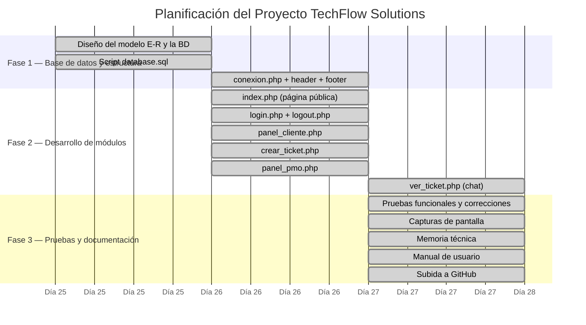

# Diagrama de Gantt — TechFlow Solutions

## Código Mermaid (para pegar en cualquier editor compatible)

### PIDELE A CHATGPT QUE TE CAMBIE LAS FECHAS O SI QUIERES ESPECIFICAR, QUE CUESTA UN POCO MODIFICAR LAS FECHAS A MANO. ES MUY IMPORTANTE QUE NO TE LO BORRE

Pegar en: https://mermaid.live · todiagram.com · o el plugin Mermaid de VS Code

## Notas sobre las decisiones de planificación

Durante la fase inicial de planificación se valoró usar **WordPress con plugins de gestión de tickets** como punto de partida. Sin embargo, se descartó porque:
- Los plugins disponibles no integraban un módulo PMO nativo.
- La personalización del modelo de datos era muy limitada.
- No permitía aprender el funcionamiento interno de la tecnología.

Se optó por desarrollar desde cero con **PHP + MySQL + Bootstrap**, lo que implicó una inversión mayor en aprendizaje (consulta de documentación oficial, tutoriales y cursos en línea) pero aportó un dominio mucho más completo de las tecnologías implicadas.

## Para usar en todiagram

Pegar el bloque mermaid en: https://todiagram.com
o en la web oficial de Mermaid: https://mermaid.live

Exportar como PNG y pegar en la memoria en el apartado 3.5.
