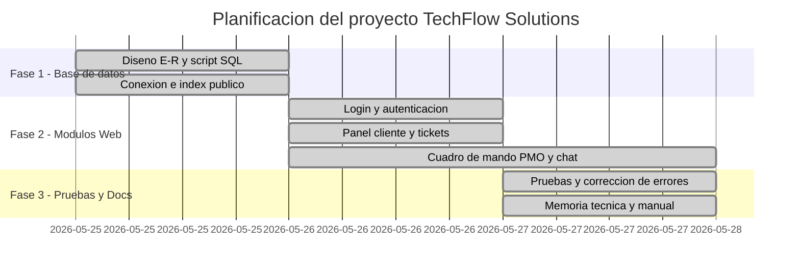
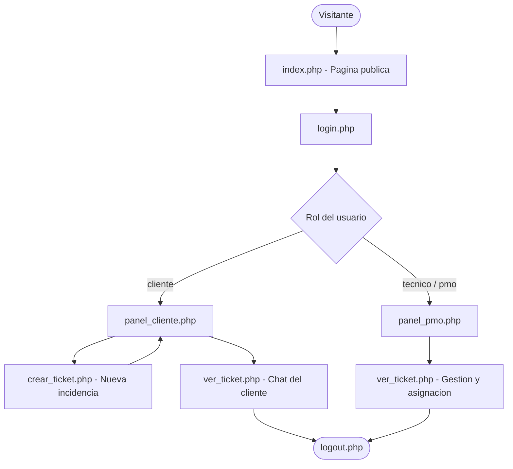
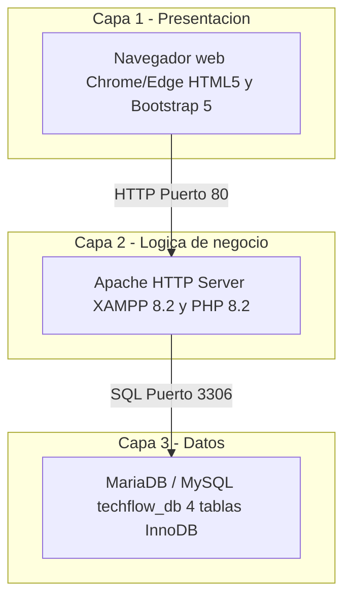
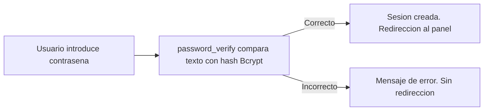

# Diagramas Mermaid — TechFlow Solutions

A continuación tienes todos los códigos Mermaid extraídos de la memoria. Se han limpiado los caracteres especiales para evitar errores de sintaxis en los distintos editores (como todiagram.com).

## 1. Diagrama de Gantt

*(Nota: Si tu editor sigue sin aceptar el tipo `gantt`, usa la alternativa en formato de tabla de más abajo)*

## 2. Flujo de navegación

## 3. Arquitectura de red (3 capas)

## 4. Esquema de autenticación (Bcrypt)

