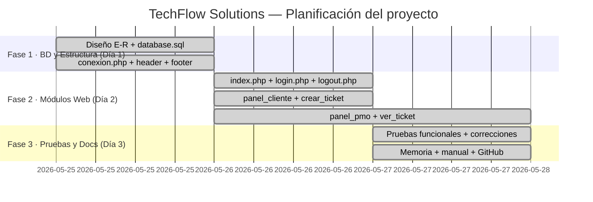
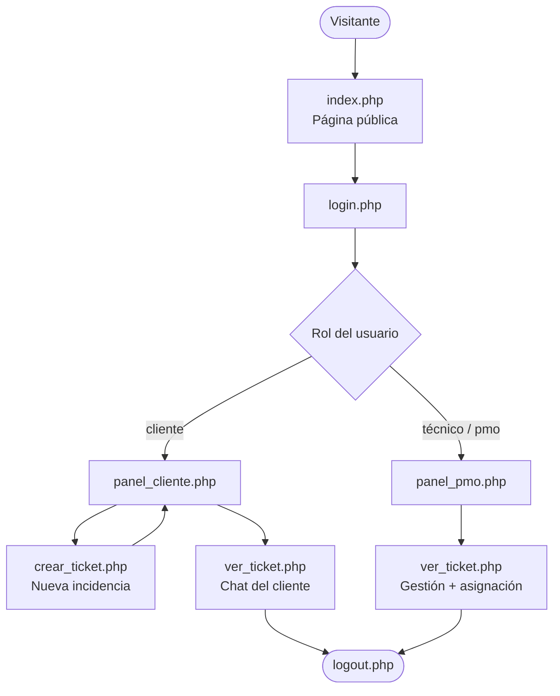
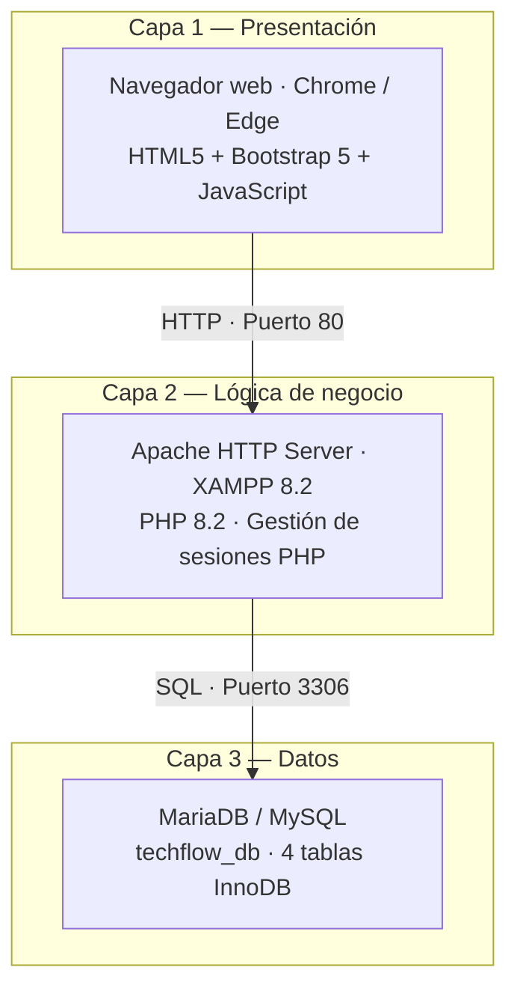
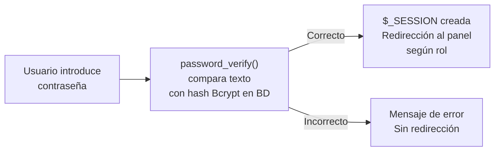

# Diagramas Mermaid — TechFlow Solutions

A continuación tienes todos los códigos Mermaid extraídos de la memoria para que puedas generar las imágenes copiándolos en herramientas como [Mermaid Live Editor](https://mermaid.live) o [ToDiagram](https://todiagram.com).

## 1. Diagrama de Gantt

## 2. Flujo de navegación

## 3. Arquitectura de red (3 capas)

## 4. Esquema de autenticación (Bcrypt)

