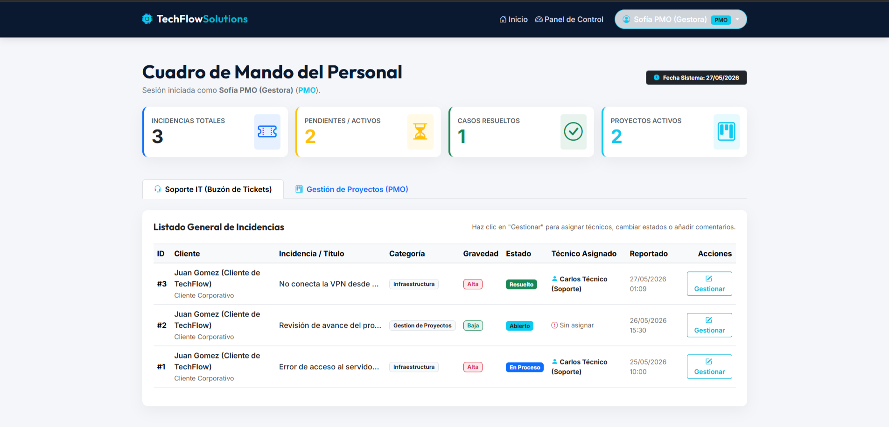
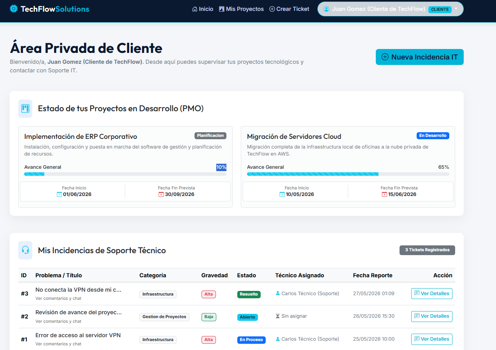
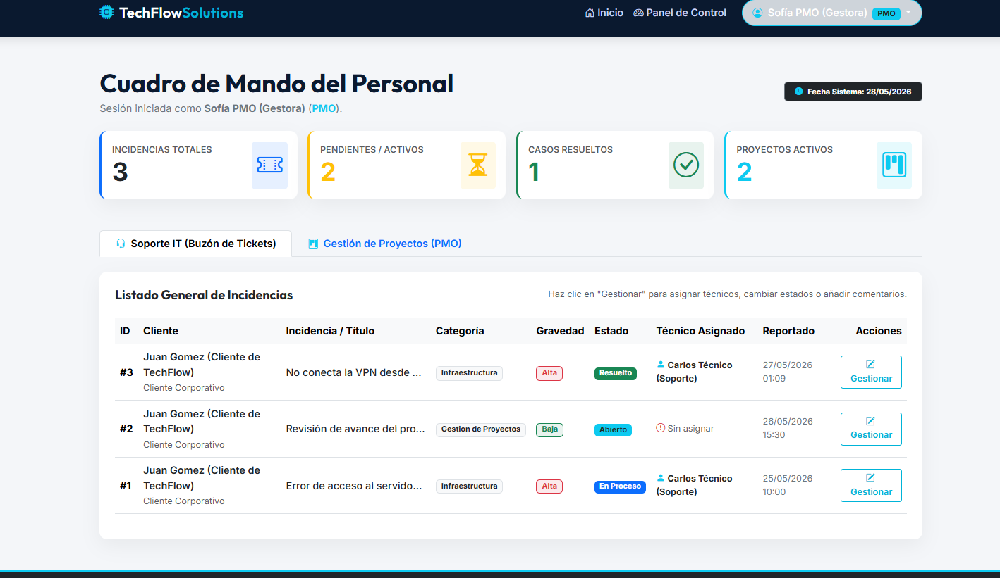

# MANUAL DE USUARIO
## Portal Corporativo TechFlow Solutions
### Proyecto Final de Grado Medio SMR

---

> **Versión:** 1.0 | **Fecha:** Mayo 2026 | **Autora:** Shannon (FP Dual Intensiva SMR)

---

## ÍNDICE DEL MANUAL

1. [Introducción y Acceso al Portal](#1-introducción-y-acceso-al-portal)
2. [Perfiles de Usuario Disponibles](#2-perfiles-de-usuario-disponibles)
3. [Módulo Público: Página Corporativa (index.php)](#3-módulo-público-página-corporativa)
4. [Inicio de Sesión (login.php)](#4-inicio-de-sesión)
5. [Manual del Cliente: Panel Privado (panel_cliente.php)](#5-manual-del-cliente)
6. [Manual del Cliente: Crear Incidencia (crear_ticket.php)](#6-crear-una-nueva-incidencia)
7. [Manual del Personal: Cuadro de Mando PMO (panel_pmo.php)](#7-cuadro-de-mando-del-personal-pmo-y-técnico)
8. [Gestión de Tickets y Chat de Soporte (ver_ticket.php)](#8-gestión-y-seguimiento-de-tickets)
9. [Cerrar Sesión (logout.php)](#9-cerrar-sesión)
10. [Credenciales de Prueba](#10-credenciales-de-prueba)

---

## 1. Introducción y Acceso al Portal

El portal **TechFlow Solutions** es una plataforma web empresarial que unifica la gestión de proyectos (PMO) y el soporte técnico IT en un único entorno digital. Está diseñado para tres tipos de usuarios: clientes, técnicos de soporte y gestores de proyectos (PMO).

### Requisitos para acceder

| Elemento | Detalle |
|----------|---------|
| **Navegador** | Google Chrome, Microsoft Edge o Firefox (versión actual) |
| **URL de acceso local** | `http://localhost/techflowsolution/` |
| **Servidor requerido** | XAMPP activo con Apache y MySQL en marcha |

Para verificar que el servidor está activo, abre el Panel de Control de XAMPP y comprueba que los módulos **Apache** y **MySQL** muestran fondo verde.

---

## 2. Perfiles de Usuario Disponibles

El sistema dispone de tres perfiles de acceso con permisos diferenciados:

| Perfil | Descripción | Panel de Acceso |
|--------|-------------|-----------------|
| **Cliente** | Empresa o persona que contrata los servicios. Puede ver sus proyectos y reportar incidencias. | `panel_cliente.php` |
| **Técnico** | Personal de soporte IT que recibe y gestiona los tickets de incidencias. | `panel_pmo.php` |
| **PMO (Gestora)** | Responsable de proyectos que supervisa el progreso y coordina con soporte. | `panel_pmo.php` |

---

## 3. Módulo Público: Página Corporativa

Al acceder a la URL `http://localhost/techflowsolution/index.php`, cualquier visitante puede ver la página corporativa sin necesidad de iniciar sesión.

**Figura 1: Página Principal Corporativa de TechFlow Solutions**


*Figura 1. Vista de la página corporativa principal (index.php). Se muestran los servicios integrados de Soporte IT y gestión PMO, con botones de acceso al portal de cliente.*

La página corporativa incluye:
- **Cabecera navegable** con el logotipo de TechFlow Solutions y enlace directo al panel de control.
- **Banner hero** con el eslogan corporativo y botones de llamada a la acción: "Área de Soporte" y "Conocer Servicios".
- **Sección de Servicios Integrados** donde se describe la oferta de Soporte IT, PMO y Consultoría Cloud.
- **Formulario de Contacto** para que nuevos clientes potenciales soliciten información.

> **Nota para el tribunal:** En la barra de navegación superior, si el usuario tiene sesión activa, aparecerá su nombre y rol en un botón desplegable con la opción de cerrar sesión.

---

## 4. Inicio de Sesión

Para acceder al área privada del portal, navega a:
```
http://localhost/techflowsolution/login.php
```

**Figura 2: Pantalla de Inicio de Sesión del Portal**



*Figura 2. Formulario de autenticación del portal corporativo (login.php). Muestra el panel administrativo del usuario PMO en la sesión activa.*

### Pasos para iniciar sesión:

1. Introduce tu **correo electrónico** en el primer campo.
2. Introduce tu **contraseña** en el segundo campo.
3. Haz clic en el botón **"Iniciar Sesión"**.

El sistema validará las credenciales contra la base de datos `techflow_db`. Según el rol asignado:
- Si el rol es **`cliente`** → El sistema redirige a `panel_cliente.php`.
- Si el rol es **`tecnico`** o **`pmo`** → El sistema redirige a `panel_pmo.php`.

### Mensajes de error habituales:

| Mensaje | Causa |
|---------|-------|
| "Por favor, completa todos los campos." | Se ha dejado vacío el correo o la contraseña. |
| "No existe ninguna cuenta asociada a este correo electrónico." | El correo no está registrado en la base de datos. |
| "La contraseña introducida es incorrecta." | El correo existe pero la contraseña no coincide con el hash almacenado. |

---

## 5. Manual del Cliente

Tras el inicio de sesión con credenciales de cliente, el sistema redirige al **Panel de Control del Cliente**.

**Figura 3: Panel de Control Privado del Cliente**



*Figura 3. Panel privado del cliente (panel_cliente.php). Muestra los proyectos contratados con barra de progreso y el historial de tickets de soporte.*

El panel del cliente tiene **dos secciones** accesibles mediante pestañas de navegación:

### Pestaña 1: Gestión de Proyectos (PMO)

Muestra una tarjeta por cada proyecto contratado con la consultora, incluyendo:

| Campo visible | Descripción |
|---------------|-------------|
| **Nombre del proyecto** | Título comercial acordado en el contrato. |
| **Descripción** | Alcance y objetivos del proyecto. |
| **Estado** | Fase actual: Planificación, En Desarrollo, Pruebas o Completado. |
| **Barra de progreso** | Porcentaje visual del avance completado (0-100%). |
| **Fechas** | Fecha de inicio y fecha estimada de finalización. |

### Pestaña 2: Soporte IT (Mis Tickets)

Lista el historial completo de incidencias que el cliente ha reportado, con su estado actual y un botón para ver el chat de seguimiento de cada una.

- Botón **"Ver Detalle / Chat"**: Abre la vista de seguimiento del ticket seleccionado.
- Botón **"Crear Nueva Incidencia"**: Acceso directo al formulario de alta de ticket.

---

## 6. Crear una Nueva Incidencia

Cuando el cliente detecta un problema técnico o necesita soporte, debe crear un nuevo ticket. Para ello:

1. En el menú de navegación, hacer clic en **"Área de Soporte"** o bien en el botón **"Crear Nueva Incidencia"** desde el panel de cliente.
2. El sistema carga el formulario en `crear_ticket.php`.

### Campos del formulario de alta de incidencia:

| Campo | Tipo | Descripción |
|-------|------|-------------|
| **Título de la Incidencia** | Texto obligatorio | Breve descripción del fallo (máx. 150 caracteres). |
| **Categoría** | Selector desplegable | Soporte Técnico / Gestión de Proyectos / Infraestructura. |
| **Gravedad** | Selector desplegable | Baja / Media / Alta / Crítica (según el impacto en el negocio). |
| **Descripción detallada** | Área de texto | Explicación completa del problema: síntomas, errores observados, pasos previos realizados. |

3. Revisar los campos y hacer clic en **"Registrar Incidencia"**.
4. El sistema genera un nuevo registro en la tabla `tickets` con estado **"Abierto"** y muestra un mensaje de confirmación con el número de ticket asignado.

> **Buena práctica:** Cuanto más detallada sea la descripción de la incidencia, más rápido podrá el técnico asignado diagnosticar y resolver el problema.

---

## 7. Cuadro de Mando del Personal (PMO y Técnico)

El personal de la consultora (técnicos y gestoras PMO) accede a un panel administrativo unificado.

**Figura 4: Cuadro de Mando Administrativo del Personal TechFlow**



*Figura 4. Panel de control del personal (panel_pmo.php). Muestra los KPIs estadísticos en la cabecera y la tabla de gestión global de tickets. Se observan los tickets #1, #2 y #3 con sus respectivos estados: "En Proceso", "Abierto" y "Resuelto".*

### Cabecera de KPIs (Indicadores Clave de Rendimiento)

| Indicador | Descripción |
|-----------|-------------|
| **Incidencias Totales** | Número total de tickets en el sistema. |
| **Pendientes / Activos** | Tickets con estado "Abierto" o "En Proceso". |
| **Casos Resueltos** | Tickets con estado "Resuelto" o "Cerrado". |
| **Proyectos Activos** | Proyectos en fase "En Desarrollo" o "Planificación". |

### Pestaña 1: Soporte IT (Buzón de Tickets)

Tabla global que lista **todos los tickets de todos los clientes**. Columnas visibles:

- **ID** del ticket
- **Cliente** que reportó la incidencia
- **Título** del problema
- **Categoría** y **Gravedad**
- **Estado** actual (con badge de color)
- **Técnico Asignado** (o "Sin asignar" si está libre)
- **Fecha** de apertura
- Botón **"Gestionar"** para abrir la ficha completa del ticket

### Pestaña 2: Gestión de Proyectos (PMO)

Tabla con todos los proyectos de la cartera de clientes activos, con su porcentaje de progreso y estado del ciclo de vida PMO.

---

## 8. Gestión y Seguimiento de Tickets

Al hacer clic en el botón **"Gestionar"** desde el panel PMO, o en **"Ver Detalle"** desde el panel cliente, se abre la vista completa del ticket en `ver_ticket.php`.

Esta vista tiene dos zonas:

### Zona Izquierda: Chat de Seguimiento

Muestra el histórico de mensajes entre el cliente y el técnico en formato de burbuja de conversación. Para añadir un nuevo mensaje:
1. Escribir el texto en el área de texto de la parte inferior.
2. Hacer clic en **"Enviar Mensaje"**.
3. El mensaje queda registrado en la tabla `comentarios_tickets` con la fecha y hora exactas.

### Zona Derecha: Panel de Gestión (solo para Técnicos y PMO)

Los usuarios con rol `tecnico` o `pmo` disponen de un panel lateral adicional con los siguientes controles:

| Control | Descripción |
|---------|-------------|
| **Asignar Técnico** | Selector desplegable con todos los técnicos disponibles. Permite asignar o reasignar el responsable del caso. |
| **Actualizar Estado** | Cambiar el ciclo de vida del ticket: Abierto → En Proceso → Resuelto → Cerrado. |
| Botón **"Guardar Cambios"** | Ejecuta un `UPDATE` en la tabla `tickets` con los nuevos valores. |

> **Seguridad importante:** Si un cliente intenta acceder a la URL de un ticket que no le pertenece (por ejemplo, modificando el ID en la barra de direcciones), el sistema detecta la discrepancia entre el `cliente_id` del ticket y el `$_SESSION['usuario_id']` activo, bloqueando el acceso y redirigiendo al login.

---

## 9. Cerrar Sesión

Para finalizar la sesión de usuario de forma segura:
1. Hacer clic en el nombre de usuario en la esquina superior derecha de la barra de navegación.
2. En el menú desplegable que aparece, seleccionar **"Cerrar Sesión"**.
3. El sistema ejecuta `session_destroy()` en `logout.php`, borrando todas las variables de sesión del servidor.
4. El usuario es redirigido automáticamente a la página corporativa `index.php`.

---

## 10. Credenciales de Prueba

Para testear todas las funcionalidades del sistema, se han cargado los siguientes usuarios de prueba en la base de datos:

| Rol | Nombre | Correo electrónico | Contraseña |
|-----|--------|--------------------|------------|
| **Cliente** | Juan Gómez | `cliente@techflow.com` | `password123` |
| **Técnico** | Carlos Técnico | `tecnico@techflow.com` | `password123` |
| **PMO (Gestora)** | Sofía PMO | `pmo@techflow.com` | `password123` |

> **Advertencia de Seguridad:** Estas credenciales son exclusivamente para el entorno de pruebas local (localhost). En un entorno de producción real, las contraseñas deben ser únicas, complejas y nunca compartidas en documentación pública.

---

*Manual generado para el Proyecto Final de Grado Medio SMR · TechFlow Solutions · Mayo 2026*
