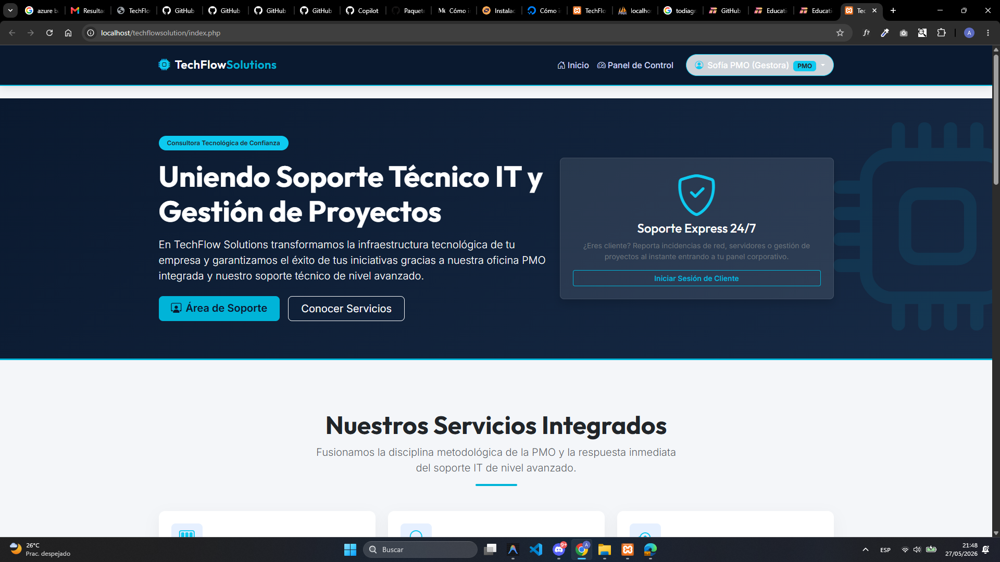

# PLATAFORMA WEB INTEGRADA DE GESTIÓN DE INCIDENCIAS Y PROYECTOS — TECHFLOW SOLUTIONS
**SMR — Departamento de Informática y Comunicaciones (IFC)**

---

| | |
|---|---|
| **NOMBRE DEL PROYECTO** | TechFlow Solutions — Portal de Gestión Integrada IT & PMO |
| **TÍTULO DEL PROYECTO** | Plataforma Web de Gestión de Tickets e Incidencias con Módulo PMO |
| **EMPRESA** | TechFlow Solutions |
| **CICLO FORMATIVO** | Grado Medio en Sistemas Microinformáticos y Redes (SMR) |
| **MODALIDAD** | FP Dual Intensiva |
| **AUTORA** | Shannon |
| **TUTORA DEL PROYECTO** | [Nombre de la tutora del centro] |
| **CURSO ACADÉMICO** | 2025 – 2026 |

---

*Esta obra está bajo una licencia Reconocimiento-Compartir bajo la misma licencia 3.0 España de Creative Commons.*

---

## Índice de contenido

1. INTRODUCCIÓN
2. ALCANCE DEL PROYECTO
3. ESTUDIO DE VIABILIDAD
   - 3.1 Estado actual del sistema
   - 3.2 Requisitos del cliente
   - 3.3 Posibles soluciones
   - 3.4 Solución elegida
   - 3.5 Planificación temporal de las tareas del proyecto [TechFlow Solutions]
   - 3.6 Planificación de los recursos a utilizar
4. ANÁLISIS
   - 4.1 Requisitos funcionales
   - 4.2 Requisitos no funcionales
5. DISEÑO
   - 5.1 Estructura de la aplicación
   - 5.2 Componentes del sistema
   - 5.3 Arquitectura de la red
   - 5.4 Herramientas
6. IMPLEMENTACIÓN
   - 6.1 Entorno de implementación
   - 6.2 Tablas creadas
   - 6.3 Carga de datos
   - 6.4 Ficheros de configuración actualizados
   - 6.5 Configuraciones realizadas en el sistema
   - 6.6 Implementaciones de código realizadas
7. PRUEBAS
   - 7.1 Casos de pruebas
8. EXPLOTACIÓN
   - 8.1 Planificación
   - 8.2 Preparación para el cambio
   - 8.3 Plan de formación
   - 8.4 Implantación propiamente dicha
   - 8.5 Pruebas de implantación
9. DEFINICIÓN DE PROCEDIMIENTOS DE CONTROL Y EVALUACIÓN
10. CONCLUSIONES
11. FUENTES
12. ANEXOS
    - 12.1 Manual de usuario

---

## 1. INTRODUCCIÓN

Este documento recoge el trabajo realizado para el **proyecto final** del Ciclo Formativo de Grado Medio en **Sistemas Microinformáticos y Redes (SMR)**, modalidad FP Dual Intensiva.

La alumna realizó su FP Dual en la empresa co-formadora **TechFlow Solutions**, donde comenzó en el departamento de **Soporte IT Nivel 1** y fue promocionada internamente a tareas de apoyo a la **PMO (Oficina de Gestión de Proyectos)**. Esta experiencia práctica directa en empresa motivó el desarrollo de una plataforma web que integra ambas funciones en un único sistema.

A lo largo del período de prácticas, se observó la necesidad real de digitalizar los procesos de la empresa. Para afrontar el desarrollo, se realizaron búsquedas de documentación técnica, se consultaron recursos de aprendizaje en línea (tutoriales de PHP, MySQL y Bootstrap) y se fue construyendo la plataforma de forma progresiva, aplicando los conocimientos adquiridos en cada módulo del ciclo formativo.

---

## 2. ALCANCE DEL PROYECTO

El propósito de este proyecto es **diseñar, desarrollar y desplegar una plataforma web corporativa** para la consultora TechFlow Solutions, que permita unificar en un único entorno digital la gestión de proyectos PMO y el soporte técnico IT.

El objetivo concreto es crear una aplicación web funcional, segura y de aspecto profesional que:

- Permita a los clientes consultar el estado de sus proyectos y reportar incidencias.
- Permita al personal técnico y gestor supervisar, asignar y resolver dichas incidencias desde un cuadro de mando centralizado.

El desarrollo se lleva a cabo en varias fases: estudio de viabilidad, análisis, diseño, implementación, pruebas y explotación.

---

## 3. ESTUDIO DE VIABILIDAD

En esta fase se considera si el proyecto se puede realizar teniendo en cuenta las circunstancias de la empresa, las soluciones posibles y los recursos disponibles.

### 3.1 Estado actual del sistema

El sistema actual de la empresa **no dispone de ninguna herramienta centralizada** para gestionar incidencias ni proyectos. La situación antes de este proyecto es:

- La comunicación con los clientes sobre incidencias se realiza íntegramente por **correo electrónico**, sin posibilidad de priorizar ni asignar responsable.
- El seguimiento de proyectos se actualiza manualmente en **hojas de cálculo Excel**, sin visibilidad en tiempo real para el cliente.
- No existe registro formal de apertura, asignación ni cierre de incidencias.
- No hay control de accesos: cualquier miembro del equipo puede ver y modificar cualquier dato.

Como consecuencia, hay incidencias sin resolver, clientes insatisfechos y ausencia de datos históricos para medir el rendimiento del equipo.

### 3.2 Requisitos del cliente

El cliente solicita para el nuevo sistema:

- Acceso desde cualquier navegador web, sin instalar software adicional.
- Acceso diferenciado por perfil: cliente, técnico de soporte y gestora PMO.
- Visualización del estado y avance de los proyectos en tiempo real.
- Posibilidad de reportar incidencias con título, categoría y nivel de gravedad.
- Asignación de técnico responsable y seguimiento del estado de cada incidencia.
- Canal de comunicación interno entre cliente y técnico por incidencia.
- Panel de indicadores estadísticos para el equipo gestor.
- Interfaz web moderna, responsive y con imagen profesional.
- Contraseñas almacenadas de forma segura en la base de datos.

### 3.3 Posibles soluciones

Existen otras herramientas que ofrecen funcionalidades similares:

- **Jira Service Management:** Solución corporativa líder que integra soporte y proyectos. Coste elevado para una PYME, curva de aprendizaje alta y dependencia de servidores externos.
- **Zendesk / Freshdesk:** Excelente gestión de tickets, pero sin módulo PMO nativo. Para integrar ambas funciones requiere contratar servicios adicionales de pago.
- **WordPress + plugins de tickets:** Despliegue rápido, pero los plugins no integran módulo PMO real y la personalización del modelo de datos es muy limitada. Se valoró esta opción inicialmente, pero se descartó porque no permitía adaptar la estructura de datos a las necesidades concretas de la empresa.
- **Trello / Asana / Monday:** Herramientas visuales de planificación de proyectos, completamente desconectadas del canal de soporte técnico.

Ninguna de estas opciones ofrece, de forma gratuita y con despliegue sencillo, la integración real entre soporte IT y PMO que requiere la empresa.

### 3.4 Solución elegida

Se elige el **desarrollo web a medida** con PHP, MySQL y Bootstrap 5 sobre servidor Apache local (XAMPP). Esta decisión se justifica por:

- **Coste cero:** todo el software es gratuito y de código libre.
- **Control total:** el código es propiedad de la empresa, sin dependencias externas.
- **Integración real PMO + Soporte IT** en un único modelo de datos.
- **Aprendizaje:** el desarrollo en PHP procedimental permitió a la alumna aplicar directamente los conocimientos del ciclo y profundizar en áreas nuevas (seguridad web, diseño responsive con Bootstrap frente a CSS puro). Se eligió Bootstrap porque facilita el diseño responsive de forma más rápida y estandarizada que escribir media queries personalizadas desde cero.
- **Despliegue sencillo** sobre cualquier equipo con XAMPP.

Nace así el nuevo proyecto denominado **TechFlow Solutions — Portal de Gestión Integrada IT & PMO**.

### 3.5 Planificación temporal de las tareas del proyecto [TechFlow Solutions]

Se identifican las tareas del proyecto y se estima el tiempo necesario. El proyecto es desarrollado por **1 persona** en **3 días de trabajo intensivo**. Se utilizó un diagrama de Gantt para la planificación visual:

---

> 📷 **[Insertar aquí el diagrama de Gantt]**
>
> *Figura 1. Diagrama de Gantt del proyecto TechFlow Solutions. Se muestran las 3 fases principales (base de datos y estructura, desarrollo de módulos, pruebas y documentación) distribuidas en los 3 días de desarrollo.*

---

| Fase | Tarea principal | Día | Horas estimadas |
|------|----------------|-----|:---------------:|
| Base de datos | Diseño E-R + `database.sql` + `conexion.php` | 1 | 5 h |
| Estructura | `header.php` + `footer.php` | 1 | 3 h |
| Autenticación | `index.php` + `login.php` + `logout.php` | 2 | 4 h |
| Módulo cliente | `panel_cliente.php` + `crear_ticket.php` | 2 | 4 h |
| Módulo personal | `panel_pmo.php` + `ver_ticket.php` | 2–3 | 5 h |
| Pruebas | Pruebas funcionales + corrección | 3 | 3 h |
| Documentación | Memoria + manual + GitHub | 3 | 7 h |

*Tabla 1. Desglose de tareas por fase, día y horas estimadas.*

### 3.6 Planificación de los recursos a utilizar

Para solventar los problemas que plantea el proyecto TechFlow Solutions se utilizan los siguientes recursos:

**Recursos humanos:**

| Perfil | Rol | Dedicación |
|--------|-----|:----------:|
| Alumna (Shannon) | Desarrolladora web y documentadora | 100% (3 días) |
| Tutora del centro | Supervisión académica | Puntual |
| Tutora de empresa | Validación de requisitos | Puntual |

*Tabla 2. Recursos humanos del proyecto.*

**Recursos de hardware y software:**

| Recurso | Detalle |
|---------|---------|
| Equipo de desarrollo | PC Windows 11, Intel Core i5, 8 GB RAM, SSD |
| Servidor local | XAMPP 8.2 (Apache + MariaDB + PHP) |
| Editor de código | Visual Studio Code |
| Navegador de pruebas | Google Chrome con DevTools |
| Control de versiones | Git + repositorio GitHub |
| Framework CSS | Bootstrap 5.3 (CDN, gratuito) |

*Tabla 3. Recursos de hardware y software utilizados.*

**Coste económico total del proyecto: 0 €** (todo el software es libre o gratuito).

---

## 4. ANÁLISIS

En esta fase se establecen los requisitos del sistema. Una vez que el cliente acepta el nuevo proyecto, hay que dejar claro y por escrito qué requisitos debe cumplir el sistema.

### 4.1 Requisitos funcionales

Son los que determinan qué tareas tiene que hacer el sistema:

**Perfil cliente:**
- Iniciar sesión y acceder a un panel privado personalizado.
- Visualizar los proyectos contratados con nombre, estado y porcentaje de progreso.
- Consultar el historial de tickets de soporte.
- Crear nuevas incidencias con título, categoría, gravedad y descripción.
- Acceder al chat de seguimiento de cada incidencia.
- No poder ver datos ni tickets de otros clientes.

**Perfil técnico / PMO:**
- Acceder a un cuadro de mando con KPIs en tiempo real (total de incidencias, activas, resueltas, proyectos activos).
- Ver una tabla global con todas las incidencias del sistema.
- Asignar técnico responsable a cada incidencia.
- Cambiar el estado de un ticket: Abierto → En Proceso → Resuelto → Cerrado.
- Responder al cliente en el chat de seguimiento.
- Consultar la cartera de proyectos activos.

**Área pública:**
- Mostrar una página corporativa con servicios y formulario de contacto.

### 4.2 Requisitos no funcionales

Son propiedades o cualidades que el sistema debe cumplir:

- **Diseño atractivo y responsive:** adaptación a escritorio, tableta y móvil sin errores de maquetación.
- **Seguridad en contraseñas:** almacenamiento mediante hash Bcrypt, nunca en texto plano.
- **Control de sesiones:** el acceso a páginas privadas sin sesión activa redirige automáticamente al login.
- **Protección de datos entre usuarios:** un cliente no puede ver recursos de otro cliente.
- **Tiempo de respuesta:** carga de páginas inferior a 2 segundos en entorno local.
- **Codificación UTF-8:** soporte correcto de tildes y caracteres del español en todos los niveles.

---

## 5. DISEÑO

En esta fase se realiza una aproximación al diseño tecnológico de la solución. Se describe cómo desarrollar los requisitos establecidos, apoyándose en la estructura de la aplicación, la arquitectura de la red y los componentes del sistema.

### 5.1 Estructura de la aplicación

Se trata del desarrollo de una aplicación web en PHP procedimental. El árbol de archivos es el siguiente:

```
techflowsolution/
├── conexion.php          ← Conector MySQLi a la base de datos
├── header.php            ← Cabecera HTML dinámica (menú según rol)
├── footer.php            ← Pie de página corporativo común
├── index.php             ← Página corporativa pública
├── login.php             ← Autenticación y gestión de sesiones
├── logout.php            ← Cierre de sesión seguro
├── panel_cliente.php     ← Panel privado del cliente
├── crear_ticket.php      ← Formulario de nueva incidencia
├── panel_pmo.php         ← Cuadro de mando del personal
├── ver_ticket.php        ← Ficha del ticket y chat de seguimiento
├── database.sql          ← Script SQL de creación de la BD
└── imagenes-tfg/         ← Capturas del sistema para la documentación
```

*Tabla 4. Árbol de archivos del proyecto TechFlow Solutions.*

**Flujo de navegación:**

---

> 📷 **[Insertar aquí el diagrama de flujo de navegación]**
>
> *Figura 2. Flujo de navegación de la aplicación. El visitante accede a la página pública y puede iniciar sesión. Según su rol, se redirige al panel del cliente o al cuadro de mando del personal.*

---

### 5.2 Componentes del sistema

**Base de datos (`techflow_db`):** 4 tablas relacionales con motor InnoDB.

| Tabla | Función |
|-------|---------|
| `usuarios` | Almacena clientes, técnicos y gestoras con su rol y contraseña cifrada |
| `proyectos` | Proyectos contratados por cada cliente con estado PMO y progreso |
| `tickets` | Incidencias de soporte con su ciclo de vida completo |
| `comentarios_tickets` | Mensajes del chat de seguimiento de cada ticket |

*Tabla 5. Tablas de la base de datos techflow_db.*

**Diagrama de la base de datos:**

---



*Figura 3. Diagrama de relaciones de la base de datos techflow_db generado con phpMyAdmin. Se observan las 4 tablas InnoDB con sus claves primarias (PK), campos y las relaciones entre ellas: usuarios → proyectos (1:N), usuarios → tickets (1:N × 2) y tickets → comentarios_tickets (1:N).*

---

**Servidor web:** Apache (XAMPP), que interpreta los scripts PHP y sirve el HTML al navegador del cliente.

**Interfaz de usuario:** HTML5 + Bootstrap 5 con iconografía de Bootstrap Icons. Se eligió Bootstrap frente a CSS puro porque proporciona un sistema de rejilla responsive ya probado, con componentes reutilizables (tarjetas, tablas, formularios) que reducen significativamente el tiempo de desarrollo.

### 5.3 Arquitectura de la red

El sistema se implementa sobre una arquitectura **cliente-servidor de tres capas** en red local:

---

> 📷 **[Insertar aquí el diagrama de arquitectura de red]**
>
> *Figura 4. Arquitectura cliente-servidor de tres capas del sistema TechFlow Solutions. Capa 1: navegador web (HTML + Bootstrap). Capa 2: servidor Apache + PHP 8.2 con gestión de sesiones. Capa 3: motor MariaDB con la base de datos techflow_db. Comunicación HTTP en el puerto 80 y MySQL en el puerto 3306.*

---

URL de acceso local: `http://localhost/techflowsolution/`

### 5.4 Herramientas

| Herramienta | Uso en el proyecto |
|-------------|-------------------|
| **XAMPP 8.2** | Servidor integrado (Apache + MariaDB + PHP) |
| **Visual Studio Code** | Editor de código principal |
| **phpMyAdmin** | Administración visual de la BD |
| **Bootstrap 5.3** | Framework CSS responsive (CDN) |
| **Bootstrap Icons** | Iconografía vectorial |
| **Git + GitHub** | Control de versiones y repositorio |
| **Google Chrome DevTools** | Depuración y pruebas responsive |

*Tabla 6. Herramientas utilizadas en el desarrollo.*

---

## 6. IMPLEMENTACIÓN

Partiendo del diseño, en esta fase se construye el sistema. Se implementa la aplicación web en PHP procedimental, se crean las tablas de la BD, se cargan los datos iniciales y se configura el entorno de servidor.

### 6.1 Entorno de implementación

El entorno utilizado es un **servidor local Apache con XAMPP 8.2** sobre Windows 11. Los archivos del proyecto se encuentran en:

```
C:\xampp\htdocs\techflowsolution\
```

URL de acceso durante el desarrollo:

```
http://localhost/techflowsolution/index.php
```

El editor de código utilizado es **Visual Studio Code**. El control de versiones se gestiona con **Git**, con repositorio remoto en GitHub: `https://github.com/alicenon/techflow`

### 6.2 Tablas creadas

Se crean **4 tablas relacionales** en la base de datos `techflow_db` mediante el script `database.sql`:

**Tabla `usuarios`:**

| Campo | Tipo | Descripción |
|-------|------|-------------|
| `id` | INT (PK, AUTO) | Identificador único |
| `nombre` | VARCHAR(100) | Nombre completo |
| `email` | VARCHAR(100) UNIQUE | Correo de acceso |
| `password` | VARCHAR(255) | Hash Bcrypt de la contraseña |
| `rol` | ENUM('cliente','tecnico','pmo') | Nivel de permisos |
| `created_at` | TIMESTAMP | Fecha de registro |

*Tabla 7. Estructura de la tabla usuarios.*

**Tabla `proyectos`:**

| Campo | Tipo | Descripción |
|-------|------|-------------|
| `id` | INT (PK, AUTO) | ID del proyecto |
| `nombre` | VARCHAR(150) | Nombre comercial |
| `descripcion` | TEXT | Alcance del proyecto |
| `cliente_id` | INT (FK → usuarios) | Cliente propietario |
| `estado` | ENUM('Planificacion','En Desarrollo','Pruebas','Completado') | Fase PMO |
| `progreso` | INT | Porcentaje de avance (0-100) |
| `fecha_inicio` | DATE | Inicio planificado |
| `fecha_fin` | DATE | Entrega estimada |

*Tabla 8. Estructura de la tabla proyectos.*

**Tabla `tickets`:**

| Campo | Tipo | Descripción |
|-------|------|-------------|
| `id` | INT (PK, AUTO) | ID del ticket |
| `titulo` | VARCHAR(150) | Breve descripción |
| `descripcion` | TEXT | Descripción completa |
| `cliente_id` | INT (FK → usuarios) | Cliente que abre el ticket |
| `tecnico_id` | INT (FK → usuarios, NULL) | Técnico asignado |
| `categoria` | ENUM('Soporte Tecnico','Gestion de Proyectos','Infraestructura') | Categoría |
| `gravedad` | ENUM('Baja','Media','Alta','Critica') | Urgencia |
| `estado` | ENUM('Abierto','En Proceso','Resuelto','Cerrado') | Ciclo de vida |
| `created_at` | TIMESTAMP | Fecha de apertura |
| `updated_at` | TIMESTAMP | Última modificación |

*Tabla 9. Estructura de la tabla tickets.*

**Tabla `comentarios_tickets`:**

| Campo | Tipo | Descripción |
|-------|------|-------------|
| `id` | INT (PK, AUTO) | ID del comentario |
| `ticket_id` | INT (FK → tickets) | Ticket al que pertenece |
| `usuario_id` | INT (FK → usuarios) | Autor del mensaje |
| `comentario` | TEXT | Contenido del mensaje |
| `created_at` | TIMESTAMP | Fecha y hora del mensaje |

*Tabla 10. Estructura de la tabla comentarios_tickets.*

### 6.3 Carga de datos

Se insertan los siguientes **registros de prueba** en la base de datos para validar el sistema sin necesidad de crear datos manualmente:

**Usuarios de prueba:**

| Rol | Nombre | Email | Contraseña |
|-----|--------|-------|------------|
| cliente | Juan Gómez | cliente@techflow.com | password123 |
| tecnico | Carlos Técnico | tecnico@techflow.com | password123 |
| pmo | Sofía PMO | pmo@techflow.com | password123 |

*Tabla 11. Usuarios de prueba cargados en la BD. Las contraseñas se almacenan como hash Bcrypt, nunca en texto plano.*

**Proyectos de prueba:**

| Nombre | Cliente | Estado | Progreso |
|--------|---------|--------|:--------:|
| Migración de Servidores Cloud (AWS) | Juan Gómez | En Desarrollo | 65% |
| Implantación ERP Corporativo | Juan Gómez | Planificacion | 10% |

*Tabla 12. Proyectos de prueba cargados en la BD.*

### 6.4 Ficheros de configuración actualizados

El único fichero que hay que actualizar según el entorno de destino es **`conexion.php`**, con los parámetros de conexión a la base de datos:

```php
<?php
$servidor   = "localhost";    // Dirección del servidor MySQL
$usuario    = "root";         // Usuario de MySQL (vacío en XAMPP por defecto)
$contrasena = "";             // Contraseña (vacía en instalación estándar XAMPP)
$base_datos = "techflow_db";  // Nombre de la base de datos

$conexion = mysqli_connect($servidor, $usuario, $contrasena, $base_datos);
mysqli_set_charset($conexion, "utf8mb4"); // Soporte de caracteres en español
?>
```

*Figura 5. Fragmento del fichero conexion.php. Único punto de configuración de la conexión a la BD.*

### 6.5 Configuraciones realizadas en el sistema

A continuación se muestran capturas que demuestran que el sistema ha sido correctamente configurado y desplegado en el servidor local:

---

> 📷 **[Insertar aquí captura de la página principal — index.php]**
>
> *Figura 6. Página corporativa pública (index.php) accedida desde el navegador a través del servidor Apache local. La URL `localhost/techflowsolution/index.php` confirma que Apache sirve correctamente los archivos PHP del proyecto.*

---

> 📷 **[Insertar aquí captura del panel del cliente — panel_cliente.php]**
>
> *Figura 7. Panel privado del cliente. Se visualizan los proyectos y tickets recuperados en tiempo real desde la base de datos MySQL. Confirma que la conexión MySQLi a techflow_db funciona correctamente.*

---

> 📷 **[Insertar aquí captura del cuadro de mando — panel_pmo.php]**
>
> *Figura 8. Cuadro de mando del personal PMO con sesión activa de "Sofía PMO (Gestora)". Los 4 indicadores KPI se calculan mediante consultas SQL en tiempo real y la tabla global muestra todos los tickets del sistema.*

---

### 6.6 Implementaciones de código realizadas

El código fuente completo y comentado se entrega en formato electrónico en el **repositorio GitHub del proyecto**: `https://github.com/alicenon/techflow`

A continuación se comentan los aspectos más significativos de la implementación:

**Sistema de autenticación segura — `login.php`:**

La seguridad de las contraseñas es uno de los aspectos más críticos del sistema. Las contraseñas nunca se almacenan en texto plano. En su lugar, se utiliza el algoritmo **Bcrypt**, que transforma la contraseña en un hash unidireccional. Incluso si alguien accediera a la base de datos, no podría recuperar la contraseña original.

El proceso de autenticación sigue el siguiente esquema:

```
Usuario introduce contraseña
         │
         ▼
  password_verify()
  compara el texto con el hash Bcrypt almacenado en BD
         │
    ┌────┴─────┐
  Correcto   Incorrecto
    │              │
  $_SESSION    Mensaje
  creada        de error
    │
  Redirección al panel según rol
```

*Figura 9. Esquema simplificado del proceso de autenticación con hash Bcrypt en login.php.*

El sistema no permite acceder a ninguna página privada sin sesión activa. Si se intenta acceder directamente a una URL privada, se redirige automáticamente al formulario de login.

**KPIs estadísticos en tiempo real — `panel_pmo.php`:**

El cuadro de mando calcula los indicadores clave mediante consultas SQL `COUNT(*)` en cada carga de página, garantizando datos siempre actualizados:

```php
// Total de incidencias en el sistema
$total = mysqli_fetch_assoc(
    mysqli_query($conexion, "SELECT COUNT(*) AS n FROM tickets")
)['n'];

// Incidencias activas (pendientes de resolver)
$activas = mysqli_fetch_assoc(
    mysqli_query($conexion,
        "SELECT COUNT(*) AS n FROM tickets
         WHERE estado IN ('Abierto','En Proceso')")
)['n'];
```

*Figura 10. Fragmento de código del panel_pmo.php para el cálculo de KPIs en tiempo real.*

---

## 7. PRUEBAS

Son muchas las pruebas que se pueden realizar en un proyecto para eliminar errores y garantizar el correcto funcionamiento. Los casos de prueba establecen las condiciones que permiten determinar si los requisitos se cumplen o no.

### 7.1 Casos de pruebas

Se han ejecutado los siguientes casos de prueba para verificar los requisitos más importantes:

---

**CP-01: Inicio de sesión correcto**

| Campo | Detalle |
|-------|---------|
| **Identificador** | CP-01 |
| **Descripción** | El cliente inicia sesión con credenciales válidas y accede a su panel. |
| **Condiciones** | XAMPP activo. BD importada. Sin sesión previa. |
| **Entrada** | Email: `cliente@techflow.com` / Contraseña: `password123` |
| **Resultado esperado** | Redirección a `panel_cliente.php` con nombre del usuario en la barra de navegación. |
| **Resultado obtenido** | Correcto. |
| **Evaluación** | ✅ SUPERADO |

---

**CP-02: Rechazo de credenciales incorrectas**

| Campo | Detalle |
|-------|---------|
| **Identificador** | CP-02 |
| **Descripción** | El sistema rechaza una contraseña inválida sin exponer información. |
| **Condiciones** | Ídem CP-01. |
| **Entrada** | Email correcto / Contraseña incorrecta |
| **Resultado esperado** | Mensaje de error. Sin redirección. Sin crear sesión. |
| **Resultado obtenido** | Correcto. |
| **Evaluación** | ✅ SUPERADO |

---

**CP-03: Acceso sin sesión activa**

| Campo | Detalle |
|-------|---------|
| **Identificador** | CP-03 |
| **Descripción** | El acceso directo a una página privada sin sesión redirige al login. |
| **Condiciones** | Navegador en ventana de incógnito. |
| **Entrada** | URL directa: `http://localhost/techflowsolution/panel_pmo.php` |
| **Resultado esperado** | Redirección automática a `login.php`. |
| **Resultado obtenido** | Correcto. |
| **Evaluación** | ✅ SUPERADO |

---

**CP-04: Creación de un nuevo ticket**

| Campo | Detalle |
|-------|---------|
| **Identificador** | CP-04 |
| **Descripción** | El cliente crea una incidencia y queda registrada en la BD. |
| **Condiciones** | Sesión activa como cliente. |
| **Entrada** | Título, categoría, gravedad y descripción del ticket. |
| **Resultado esperado** | El ticket aparece en el panel del cliente y en el buzón del personal. |
| **Resultado obtenido** | Correcto. |
| **Evaluación** | ✅ SUPERADO |

---

**CP-05: Asignación de técnico y cambio de estado**

| Campo | Detalle |
|-------|---------|
| **Identificador** | CP-05 |
| **Descripción** | El personal asigna un técnico y cambia el estado del ticket. |
| **Condiciones** | Sesión activa como técnico. Ticket en estado "Abierto". |
| **Entrada** | Selección de técnico + estado "En Proceso" → Guardar. |
| **Resultado esperado** | El ticket queda actualizado. El KPI "Activos" se incrementa. |
| **Resultado obtenido** | Correcto. |
| **Evaluación** | ✅ SUPERADO |

---

**CP-06: Diseño responsive en móvil**

| Campo | Detalle |
|-------|---------|
| **Identificador** | CP-06 |
| **Descripción** | La interfaz se adapta correctamente a resolución de móvil (375px). |
| **Condiciones** | Chrome DevTools → iPhone SE (375px). |
| **Entrada** | Navegación completa por todas las páginas. |
| **Resultado esperado** | Menú hamburguesa, tarjetas apiladas, sin scroll horizontal. |
| **Resultado obtenido** | Correcto. Bootstrap 5 adapta el layout en todas las vistas. |
| **Evaluación** | ✅ SUPERADO |

---

**Resumen de pruebas:**

| ID | Caso de prueba | Evaluación |
|----|---------------|:----------:|
| CP-01 | Login con credenciales válidas | ✅ SUPERADO |
| CP-02 | Rechazo de contraseña incorrecta | ✅ SUPERADO |
| CP-03 | Protección sin sesión activa | ✅ SUPERADO |
| CP-04 | Creación de nuevo ticket | ✅ SUPERADO |
| CP-05 | Asignación técnico + cambio estado | ✅ SUPERADO |
| CP-06 | Diseño responsive en móvil | ✅ SUPERADO |

*Tabla 13. Resumen de los casos de prueba ejecutados. 6/6 superados.*

**Plantilla para errores detectados durante la prueba final:**

| Fecha / autora | Caso de prueba | Evaluación | Posible causa | Corrección aplicada | Áreas afectadas |
|---|---|---|---|---|---|
| | | | | | |

*Tabla 14. Registro de incidencias detectadas en las pruebas. Completar si se detecta algún error.*

---

## 8. EXPLOTACIÓN

La implantación es la fase más crítica del proyecto, ya que el sistema entra en producción operando con usuarios y datos reales.

### 8.1 Planificación

| Nº | Tarea | Responsable | Tiempo | Riesgo |
|----|-------|------------|:------:|:------:|
| 1 | Instalación de XAMPP en el servidor de destino | Técnico IT | 1 h | Bajo |
| 2 | Copia de archivos PHP al directorio htdocs | Técnico IT | 30 min | Bajo |
| 3 | Creación de la BD e importación del SQL | Técnico IT | 30 min | Medio |
| 4 | Verificación de conexion.php | Técnico IT | 15 min | Bajo |
| 5 | Prueba de acceso y validación funcional | Técnico + PMO | 1 h | Bajo |
| 6 | Formación a los usuarios del sistema | PMO | 2 h | Bajo |

*Tabla 15. Planificación de la implantación.*

**Riesgos identificados:**
- **Puerto 80 ocupado** por otro servicio (IIS, Teams): cambiar `Listen 80` por `Listen 8080` en `httpd.conf`.
- **Credenciales de BD incorrectas en destino:** editar `conexion.php` antes del despliegue.

### 8.2 Preparación para el cambio

Para la implantación hay que tener en cuenta:

- El técnico necesita **acceso de administrador** al servidor para instalar XAMPP.
- Se deben comunicar con antelación los cambios al equipo, explicando los beneficios respecto al sistema de correo electrónico actual.
- Antes de la implantación se realizará un **backup** del sistema anterior (hojas de cálculo y correos archivados).

### 8.3 Plan de formación

| Perfil | Contenido | Duración |
|--------|-----------|:--------:|
| **Clientes** | Acceso, proyectos, creación y seguimiento de tickets | 45 min |
| **Técnicos** | Gestión del buzón, asignación, estados, chat | 60 min |
| **PMO** | Cuadro de mando, KPIs, cartera de proyectos | 60 min |

*Tabla 16. Plan de formación por perfil de usuario. Documentación disponible en el Anexo 12.1.*

### 8.4 Implantación propiamente dicha

**Paso 1 — Servidor:** instalar XAMPP 8.2 y arrancar Apache y MySQL desde el Panel de Control.

**Paso 2 — Aplicación:** copiar todos los archivos del proyecto en `C:\xampp\htdocs\techflowsolution\`.

**Paso 3 — Base de datos:**
1. Acceder a `http://localhost/phpmyadmin/`
2. Crear la base de datos `techflow_db` con collation `utf8mb4_unicode_ci`
3. Importar `database.sql` desde la pestaña "Importar"

**Paso 4 — Verificación:** acceder a `http://localhost/techflowsolution/index.php` y comprobar que carga correctamente.

### 8.5 Pruebas de implantación

| Prueba | Estado |
|--------|:------:|
| Página index carga sin errores PHP | ✅ OK |
| Login funciona con los 3 perfiles | ✅ OK |
| Ticket creado por cliente visible en panel PMO | ✅ OK |
| Diseño responsive en móvil | ✅ OK |
| Log de Apache sin errores nuevos | ✅ OK |

*Tabla 17. Resultados de las pruebas de implantación en el entorno de destino.*

---

## 9. DEFINICIÓN DE PROCEDIMIENTOS DE CONTROL Y EVALUACIÓN

**Registro de incidencias detectadas durante el desarrollo:**

| Fecha | ID | Descripción | Causa | Corrección | Áreas afectadas |
|-------|----|-------------|-------|------------|-----------------|
| 27/05/2026 | INC-01 | Tildes y eñes aparecen como símbolos extraños | Falta de charset UTF-8 en la conexión | Se añadió `mysqli_set_charset($conexion, "utf8mb4")` | `conexion.php` |
| 27/05/2026 | INC-02 | El panel PMO era accesible sin autenticación por URL directa | Falta del control de sesión al inicio del script | Se añadió comprobación de `$_SESSION` con redirección al login | `panel_pmo.php`, `panel_cliente.php` |

*Tabla 18. Registro de incidencias detectadas y resueltas durante el desarrollo.*

**Registro de cambios en el proyecto:**

| Fecha | Cambio | Justificación | Áreas afectadas |
|-------|--------|---------------|-----------------|
| 26/05/2026 | Adición del campo `updated_at` en tickets | Registrar la última modificación para los KPIs | `database.sql`, `panel_pmo.php` |
| 27/05/2026 | Creación de carpeta `imagenes-tfg/` | Requisito de documentación técnica IFC | Documentación |

*Tabla 19. Registro de cambios realizados durante el proyecto.*

---

## 10. CONCLUSIONES

El proyecto **TechFlow Solutions** se ha completado satisfactoriamente, cumpliendo los objetivos técnicos y académicos establecidos. Los 6 casos de prueba definidos han sido superados al 100%, validando la funcionalidad, seguridad y usabilidad del sistema.

El desarrollo ha supuesto una simulación real de los retos técnicos de una consultoría informática, permitiendo aplicar de forma integrada los conocimientos del ciclo formativo: bases de datos, desarrollo web, seguridad, redes y administración de sistemas.

La metodología de trabajo —investigar, aprender y aplicar de forma progresiva— ha resultado muy efectiva. Se consultó documentación oficial (PHP, MySQL, Bootstrap), recursos en línea y tutoriales, e ir construyendo cada módulo a medida que se adquirían los conocimientos necesarios.

**Objetivos cumplidos:**
- Base de datos relacional normalizada en MySQL. ✅
- Aplicación web funcional en PHP procedimental. ✅
- Autenticación segura con hash Bcrypt. ✅
- Interfaz responsive con Bootstrap 5. ✅
- Cuadro de mando PMO con KPIs en tiempo real. ✅
- Documentación técnica completa. ✅

**Mejoras futuras posibles:**
- Notificaciones automáticas por email cuando un ticket cambia de estado.
- Subida de archivos adjuntos a los tickets.
- Gráficos estadísticos con Chart.js en el cuadro de mando.
- Despliegue en servidor de producción con HTTPS.

---

## 11. FUENTES

1. PHP Group. (2026). *PHP Manual: MySQL Improved Extension (mysqli)*. https://www.php.net/manual/es/book.mysqli.php

2. MariaDB Foundation. (2026). *MariaDB Server Documentation*. https://mariadb.com/kb/en/documentation/

3. Bootstrap Team. (2026). *Bootstrap v5.3 — Components and Grid System*. https://getbootstrap.com/docs/5.3/

4. OWASP Foundation. (2025). *OWASP Top Ten — Seguridad en aplicaciones web*. https://owasp.org/www-project-top-ten/

5. Apache Friends. (2026). *XAMPP — Documentación para Windows*. https://www.apachefriends.org/es/faq_windows.html

6. American Psychological Association. (2020). *Publication Manual of the APA* (7.ª ed.). https://apastyle.apa.org/

---

## 12. ANEXOS

### 12.1 Manual de usuario

> **Archivo adjunto:** `manual_usuario.docx`

El manual de usuario detalla paso a paso cómo utilizar cada módulo del portal TechFlow Solutions, con capturas de pantalla reales. Incluye:

- Acceso al portal y credenciales de prueba.
- Guía para el perfil **cliente**: visualización de proyectos, creación de tickets y chat.
- Guía para el perfil **técnico**: gestión del buzón, asignación y cambio de estados.
- Guía para el perfil **PMO**: cuadro de mando, KPIs y cartera de proyectos.

**Credenciales de prueba:**

| Perfil | Email | Contraseña |
|--------|-------|------------|
| Cliente | cliente@techflow.com | password123 |
| Técnico | tecnico@techflow.com | password123 |
| PMO | pmo@techflow.com | password123 |

*Tabla 20. Credenciales de prueba del sistema para la demostración.*

---

*Proyecto Final SMR · TechFlow Solutions · Mayo 2026 · IFC*
