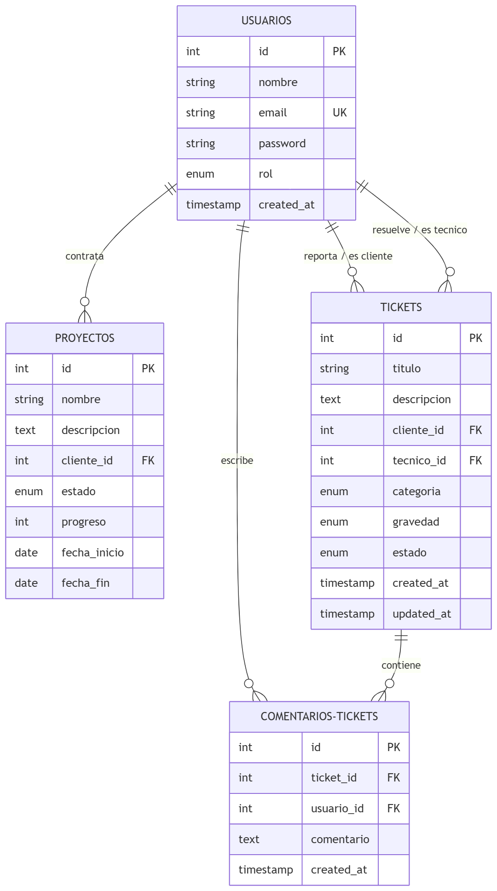

# MEMORIA DEL PROYECTO FINAL DE GRADO MEDIO
## SISTEMAS MICROINFORMÁTICOS Y REDES (SMR)

---

### FICHA DEL PROYECTO
* **Título del Proyecto:** Plataforma Web de Gestión de Tickets y Proyectos Integrados
* **Nombre de la Empresa Ficticia:** TechFlow Solutions
* **Perfil Profesional de la Alumna:** Técnico en SMR - Especialización en Soporte IT y Soporte PMO (Oficina de Gestión de Proyectos)
* **Modalidad:** FP Dual Intensiva (Promoción interna de Soporte Nivel 1 a PMO Junior)
* **Tecnologías Empleadas:** PHP Procedimental, MySQL, Bootstrap 5, HTML5, Apache
* **Entorno de Despliegue Local:** XAMPP sobre Windows 10/11

---

## INDICE GENERAL

1. **INTRODUCCIÓN Y JUSTIFICACIÓN DEL PROYECTO**
   - 1.1. Contexto Académico y Profesional
   - 1.2. Justificación de la Temática: Fusión de PMO y Soporte IT
   - 1.3. Estudio de la Competencia Investigada (Análisis de Mercado)
   - 1.4. Competencias Profesionales del Título de SMR Aplicadas
2. **OBJETIVOS DEL PROYECTO**
   - 2.1. Objetivos Técnicos
   - 2.2. Objetivos Profesionales y de Gestión
3. **ANÁLISIS DEL SISTEMA**
   - 3.1. Requisitos Funcionales
   - 3.2. Requisitos No Funcionales
   - 3.3. Recursos de Hardware y Software Empleados
4. **DISEÑO DE LA BASE DE DATOS**
   - 4.1. Modelo Entidad-Relación y Explicación
   - 4.2. Diccionario de Datos (Estructura de Tablas)
   - 4.3. Script SQL y Datos Iniciales de Prueba
5. **DESARROLLO TÉCNICO E IMPLEMENTACIÓN (PHP & BOOTSTRAP 5)**
   - 5.1. Arquitectura del Código y Conexión Procedimental
   - 5.2. Control de Sesiones y Seguridad
   - 5.3. Diseño Visual y Usabilidad con Bootstrap 5
6. **CASO PRÁCTICO RESUELTO (FLUJO COMPLETO)**
   - 6.1. Planteamiento de la Incidencia de Red
   - 6.2. Paso 1: Reporte por parte del Cliente
   - 6.3. Paso 2: Análisis y Asignación por el Técnico
   - 6.4. Paso 3: Intervención de la PMO y Cierre del Ticket
7. **CONCLUSIONES Y FUTURAS MEJORAS**
   - 7.1. Conclusiones Académicas y Profesionales
   - 7.2. Aprendizaje en la FP Dual Intensiva
   - 7.3. Propuesta de Mejoras Futuras
8. **ANEXOS Y REFERENCIAS BIBLIOGRÁFICAS**
   - 8.1. Índice de Anexos
   - 8.2. Referencias Bibliográficas (Norma APA / Notas al Pie)

---

## 1. INTRODUCCIÓN Y JUSTIFICACIÓN DEL PROYECTO

### 1.1. Contexto Académico y Profesional
El presente proyecto constituye el trabajo final para la obtención del título de **Técnico en Sistemas Microinformáticos y Redes (SMR)** en el sistema educativo español. Este proyecto ha sido diseñado bajo un enfoque metodológico adaptado a la **FP Dual Intensiva**, en la cual la alumna ha tenido la oportunidad de integrarse activamente en el tejido empresarial tecnológico durante su periodo formativo.

Durante su estancia en la empresa co-formadora, la alumna experimentó una trayectoria de crecimiento significativo: inició sus funciones operativas en el departamento de **Soporte IT Nivel 1** (atención de incidencias de hardware, software y redes básicas), y gracias a su excelente rendimiento y capacidad organizativa, promocionó de forma interna a funciones de **Soporte a la Oficina de Gestión de Proyectos (PMO)**. 

### 1.2. Justificación de la Temática: Fusión de PMO y Soporte IT
En el ámbito empresarial de las consultorías tecnológicas de tamaño medio, es muy común encontrar una brecha comunicativa y operativa entre dos departamentos fundamentales:
1. **El equipo de Soporte Técnico (Sistemas y Redes)**: Centrado en la resolución inmediata de problemas del día a día (incidentes puntuales, caídas de servicios, mantenimiento correctivo).
2. **El equipo de Gestión de Proyectos (PMO)**: Centrado en la planificación estratégica, ejecución a medio/largo plazo y aseguramiento de hitos y entregables de proyectos de desarrollo contratados por clientes.

Esta desconexión provoca ineficiencias: muchas incidencias críticas reportadas a Soporte IT derivan en realidad de problemas estructurales que requieren una modificación planificada por la PMO. 

**TechFlow Solutions** nace de la necesidad de fusionar ambas realidades en un único ecosistema digital interactivo. La alumna ha diseñado y desarrollado una plataforma web empresarial que unifica el control de los proyectos en desarrollo (PMO) y la gestión de incidencias técnicas (Sistema de Tickets). Esto permite a los clientes supervisar el avance de sus infraestructuras en una sola pantalla, y al personal de la consultora coordinar esfuerzos al instante.

### 1.3. Estudio de la Competencia Investigada (Análisis de Mercado)
Para justificar la viabilidad y el valor diferencial de la plataforma de TechFlow Solutions, se ha realizado una investigación exhaustiva de las soluciones de software comerciales dominantes en el mercado actual:

1. **Jira Service Management & Confluence (Atlassian)**: Se trata de la solución corporativa líder. Ofrece una integración excelente entre el soporte técnico y el desarrollo de proyectos informáticos. Sin embargo, para pequeñas y medianas empresas (PYMEs), el coste de licenciamiento es prohibitivo y su curva de aprendizaje y configuración es extremadamente compleja, requiriendo consultores especializados para su puesta en marcha.
2. **Zendesk & Freshdesk**: Plataformas de soporte en la nube excelentes en cuanto a la usabilidad para la gestión de tickets. No obstante, carecen por completo de un módulo de gestión de hitos y proyectos (PMO) integrado de forma nativa. Para conectar ambos mundos, las empresas se ven obligadas a pagar integraciones API de terceros que duplican los costes y fragmentan los flujos de datos.
3. **Plataformas de Proyectos (Trello, Asana, Monday)**: Herramientas fantásticas para planificar hitos en la PMO, pero completamente desconectadas de los canales de comunicación operativos y de los buzones de incidencias técnicas de los usuarios.

**El Valor Diferencial de TechFlow Solutions**: Nuestra plataforma ofrece una alternativa autohospedada (*on-premise*) y libre de licencias recurrentes. Está diseñada para correr de forma ágil sobre servidores locales modestos (XAMPP/Apache) y unifica en un único modelo de datos relacional la supervisión visual del progreso de proyectos y el chat interactivo para incidencias de sistemas. Se trata de una solución integrada, limpia y de bajo coste ideal para consultoras IT de tamaño medio.

### 1.4. Competencias Profesionales del Título de SMR Aplicadas
La realización de este proyecto final y el despliegue del portal web de TechFlow Solutions han permitido poner en práctica y consolidar de forma integrada las competencias profesionales clave contempladas en el currículo oficial del ciclo formativo de **Grado Medio en Sistemas Microinformáticos y Redes (SMR)**, reguladas en el Real Decreto 1691/2007:

* **Instalación y Configuración de Software de Aplicación**: Mediante la puesta en marcha y optimización del servidor web Apache, el motor de base de datos MariaDB/MySQL y el entorno local PHP dentro de la pila de software **XAMPP**.
* **Gestión y Configuración de Bases de Datos Relacionales**: Mediante el diseño lógico y físico de las tablas, claves primarias, claves foráneas, restricciones de integridad referencial e importación directa de scripts de migración SQL.
* **Puesta en Servicio de Servicios en Red**: Mediante la simulación del despliegue del portal web de soporte para red local y el análisis técnico y escalado de incidencias del servidor VPN corporativo y concentradores cloud (AWS).
* **Seguridad Informática y Control de Accesos**: Mediante la programación e implementación del control de acceso restringido por roles de usuario, la validación segura de variables globales de sesión y el cifrado seguro de contraseñas Bcrypt en base de datos.
* **Soporte Técnico y Atención al Usuario**: Mediante el diseño del buzón de incidencias y la interfaz de chat interactivo que emula los sistemas reales de atención (*Help Desk*) y resolución de incidencias informáticas en entornos empresariales.

---

## 2. OBJETIVOS DEL PROYECTO

### 2.1. Objetivos Técnicos
* **Diseñar y optimizar una base de datos relacional** robusta y normalizada en MySQL que organice la información de usuarios, roles, proyectos, incidencias (tickets) y el histórico de comentarios.
* **Desarrollar una aplicación web interactiva en PHP** utilizando un estilo de programación procedimental puro, el cual se alinea con el currículo oficial del ciclo formativo SMR, facilitando que el código sea comprensible, legible y completamente defendible ante un tribunal examinador.
* **Implementar un sistema de autenticación de usuarios y control de sesiones seguro** (`$_SESSION` y `password_hash` con bcrypt), restringiendo los accesos no autorizados mediante la asignación estricta de roles (`cliente`, `tecnico`, `pmo`).
* **Maquetar una interfaz web altamente estética y responsive** empleando HTML5 semántico y el framework CSS Bootstrap 5, proyectando una imagen de consultora madura a través de una cuidada paleta de colores corporativos (azul oscuro, gris pizarra y azul brillante).

### 2.2. Objetivos Profesionales y de Gestión
* **Visualizar la transición profesional de la alumna**: Demostrar mediante la plataforma web cómo las destrezas adquiridas en Soporte IT Nivel 1 se integran con las tareas metodológicas de la PMO.
* **Agilizar la comunicación cliente-empresa**: Proveer un canal tipo chat interactivo en cada ticket para evitar el uso de correos electrónicos externos y centralizar el histórico de resolución de incidencias.
* **Facilitar la toma de decisiones gerenciales**: Aportar a los técnicos y gestores de proyectos un panel de control con indicadores clave (KPIs) en tiempo real, tales como tickets abiertos, resueltos y proyectos activos.

---

## 3. ANÁLISIS DEL SISTEMA

### 3.1. Requisitos Funcionales
El sistema web de TechFlow Solutions se articula en torno a tres perfiles de usuario perfectamente definidos, cada uno con permisos y vistas exclusivas:

#### A. Módulo Público (Visitantes)
* Visualización de la página corporativa principal (`index.php`) con información de servicios de soporte informático y de PMO.
* Formulario de contacto interactivo que valida campos obligatorios y simula el procesamiento seguro del mensaje.
* Acceso independiente al portal privado a través de un panel de login (`login.php`).

#### B. Módulo de Cliente
* Autenticación segura y acceso a un panel privado personalizado (`panel_cliente.php`).
* **Sección de Proyectos (PMO)**: Visualización en tiempo real de los proyectos contratados, incluyendo el nombre, descripción, estado actual y una barra de progreso porcentual dinámica.
* **Sección de Soporte IT (Tickets)**: Lista con el histórico de incidencias creadas.
* **Creación de Tickets**: Formulario para abrir incidencias (`crear_ticket.php`) especificando título, categoría del problema, gravedad y descripción detallada.
* **Chat de Incidencia**: Acceso a la vista interactiva (`ver_ticket.php`) para añadir réplicas al técnico asignado en formato de burbujas de diálogo.

#### C. Módulo de Personal (Técnicos y Gestores PMO)
* Acceso a un panel administrativo unificado (`panel_pmo.php`) con un panel de KPIs en la cabecera.
* **Buzón de Incidencias Globales**: Tabla que lista todos los tickets del sistema de todos los clientes.
* **Gestión de Incidencias**: En la ficha individual (`ver_ticket.php`), el personal autorizado puede:
  - Asignar o cambiar el técnico responsable del caso.
  - Actualizar el estado del ticket (Abierto, En Proceso, Resuelto, Cerrado).
  - Responder al cliente añadiendo aclaraciones técnicas.
* **Supervisión de Cartera de Proyectos**: Tabla específica en el panel con todos los proyectos corporativos en desarrollo de la consultora.

### 3.2. Requisitos No Funcionales
* **Seguridad en Contraseñas**: Las claves no se almacenan nunca en texto plano. Se guardan en la base de datos cifradas mediante el algoritmo de hash unidireccional Bcrypt.
* **Seguridad de Acceso (Sesiones)**: Uso de variables de sesión PHP. Si un usuario intenta acceder directamente a las URLs privadas (`panel_cliente.php`, `panel_pmo.php`, `ver_ticket.php`) sin haber iniciado sesión, el sistema lo redirecciona automáticamente a la página de login.
* **Diseño Adaptativo (Responsive CSS)**: La interfaz es 100% responsive, adaptándose sin descuadres visuales a ordenadores de escritorio, tabletas y teléfonos móviles mediante el sistema de rejilla (grid) de Bootstrap 5.
* **Codificación Internacional**: Configuración explícita del juego de caracteres UTF-8 en HTML, PHP y MySQL para garantizar la correcta visualización de caracteres específicos del idioma español (tildes, eñes, diéresis).

### 3.3. Recursos de Hardware y Software Empleados
Para el diseño, desarrollo y pruebas locales de la plataforma, se utilizaron los siguientes recursos, habituales en las prácticas microinformáticas del Grado Medio SMR:

* **Hardware (Equipo de Desarrollo):**
  - Procesador: Intel Core i5 / AMD Ryzen 5 o superior.
  - Memoria RAM: 8 GB o 16 GB DDR4.
  - Disco de Almacenamiento: SSD de alta velocidad para agilizar la carga del servidor web local.
  - Monitor con resolución Full HD (1920x1080) para facilitar la doble pantalla con el código y el navegador.

* **Software:**
  - **Sistema Operativo:** Microsoft Windows 10/11 Home/Pro (Edición de 64 bits).
  - **Entorno Servidor Local:** XAMPP (versión 8.2), el cual integra de forma empaquetada el servidor web Apache, el motor de base de datos MariaDB (compatible con MySQL) y el intérprete de PHP.
  - **Editor de Código:** Visual Studio Code, configurado con extensiones de resaltado de sintaxis HTML/PHP y formateo automático de código.
  - **Gestor de Base de Datos:** phpMyAdmin (interfaz web de administración incluida en XAMPP) y la consola de comandos de MySQL para pruebas directas de scripts SQL.
  - **Navegador Web:** Google Chrome / Microsoft Edge con herramientas de desarrollador integradas (DevTools) para depurar estilos CSS, elementos del DOM y respuestas del servidor.

---

## 4. DISEÑO DE LA BASE DE DATOS

La base de datos **techflow_db** se ha diseñado con un esquema relacional normalizado para garantizar la integridad referencial y evitar la duplicidad de información. Cumple estrictamente con las tres primeras formas normales (3FN).

### 4.1. Modelo Entidad-Relación y Explicación
El esquema relacional cuenta con **4 tablas principales** interconectadas mediante claves primarias y foráneas:

* **Relación Usuario-Proyecto**: Relación de uno a muchos ($1:N$). Un cliente (usuario con rol `cliente`) puede tener contratados varios proyectos, pero cada proyecto pertenece únicamente a un único cliente.
* **Relaciones de Tickets**: La tabla `tickets` posee dos claves foráneas que apuntan a la tabla `usuarios`:
  - `cliente_id`: Apunta al cliente que abrió el ticket ($1:N$).
  - `tecnico_id`: Apunta al técnico de soporte o PMO que tiene asignado el caso para su resolución ($1:N$, permite valores nulos para representar tickets libres).
* **Relación Ticket-Comentarios**: Relación de uno a muchos ($1:N$). Un ticket puede contener múltiples respuestas o comentarios de seguimiento, pero cada comentario está estrictamente enlazado a un único ticket.

---

### 4.2. Diccionario de Datos (Estructura de Tablas)

#### Tabla A: `usuarios`
| Campo | Tipo de Datos | Nulo | Clave | Predeterminado | Descripción |
| :--- | :--- | :---: | :---: | :---: | :--- |
| `id` | `INT` | No | PK | *Auto-incremental* | Identificador único numérico del usuario. |
| `nombre` | `VARCHAR(100)` | No | | | Nombre y apellidos del usuario. |
| `email` | `VARCHAR(100)` | No | UK | | Correo electrónico de inicio de sesión (único). |
| `password` | `VARCHAR(255)` | No | | | Contraseña cifrada con password_hash(). |
| `rol` | `ENUM('cliente','tecnico','pmo')` | No | | | Rol de permisos en la aplicación web. |
| `created_at` | `TIMESTAMP` | No | | `CURRENT_TIMESTAMP` | Fecha y hora en la que se registró el usuario. |

#### Tabla B: `proyectos`
| Campo | Tipo de Datos | Nulo | Clave | Predeterminado | Descripción |
| :--- | :--- | :---: | :---: | :---: | :--- |
| `id` | `INT` | No | PK | *Auto-incremental* | Identificador único del proyecto PMO. |
| `nombre` | `VARCHAR(150)` | No | | | Nombre comercial del proyecto contratado. |
| `descripcion` | `TEXT` | No | | | Explicación detallada y alcance acordado. |
| `cliente_id` | `INT` | No | FK | | ID del cliente propietario (Apunta a `usuarios.id`). |
| `estado` | `ENUM('Planificacion','En Desarrollo','Pruebas','Completado')` | No | | `'Planificacion'` | Estado en el ciclo de vida del proyecto PMO. |
| `progreso` | `INT` | No | | `0` | Porcentaje de avance estimado (de 0 a 100). |
| `fecha_inicio` | `DATE` | No | | | Fecha de inicio real planificada. |
| `fecha_fin` | `DATE` | Sí | | `NULL` | Fecha de finalización estimada. |

#### Tabla C: `tickets`
| Campo | Tipo de Datos | Nulo | Clave | Predeterminado | Descripción |
| :--- | :--- | :---: | :---: | :---: | :--- |
| `id` | `INT` | No | PK | *Auto-incremental* | Identificador numérico del ticket de soporte. |
| `titulo` | `VARCHAR(150)` | No | | | Breve título descriptivo del fallo reportado. |
| `descripcion` | `TEXT` | No | | | Explicación completa del fallo. |
| `cliente_id` | `INT` | No | FK | | ID del cliente afectado (Apunta a `usuarios.id`). |
| `tecnico_id` | `INT` | Sí | FK | `NULL` | Técnico que atiende el caso (Apunta a `usuarios.id`). |
| `categoria` | `ENUM('Soporte Tecnico','Gestion de Proyectos','Infraestructura')` | No | | `'Soporte Tecnico'` | Categoría para el correcto escalado del ticket. |
| `gravedad` | `ENUM('Baja','Media','Alta','Critica')` | No | | `'Baja'` | Urgencia según el impacto en el negocio. |
| `estado` | `ENUM('Abierto','En Proceso','Resuelto','Cerrado')` | No | | `'Abierto'` | Flujo de vida del ticket de soporte. |
| `created_at` | `TIMESTAMP` | No | | `CURRENT_TIMESTAMP` | Fecha de apertura de la incidencia. |
| `updated_at` | `TIMESTAMP` | No | | `CURRENT_TIMESTAMP` | Fecha de última modificación del registro. |

#### Tabla D: `comentarios_tickets`
| Campo | Tipo de Datos | Nulo | Clave | Predeterminado | Descripción |
| :--- | :--- | :---: | :---: | :---: | :--- |
| `id` | `INT` | No | PK | *Auto-incremental* | ID del comentario en el chat de soporte. |
| `ticket_id` | `INT` | No | FK | | Enlace con el ticket (Apunta a `tickets.id`). |
| `usuario_id` | `INT` | No | FK | | ID del autor de la respuesta (Apunta a `usuarios.id`). |
| `comentario` | `TEXT` | No | | | Contenido textual del mensaje. |
| `created_at` | `TIMESTAMP` | No | | `CURRENT_TIMESTAMP` | Fecha y hora en la que se publicó el mensaje. |

### 4.3. Script SQL y Datos Iniciales de Prueba
Para ver el código SQL completo de creación e inserción de datos semilla, consulte el archivo independiente [database.sql](file:///c:/Users/emanu/Documents/SHANNON-TFG/database.sql). Este archivo se encuentra listo para importarse directamente desde la pestaña de importación de phpMyAdmin.

---

## 5. DESARROLLO TÉCNICO E IMPLEMENTACIÓN (PHP & BOOTSTRAP 5)

El código fuente de la aplicación ha sido diseñado bajo estrictos criterios de claridad y legibilidad, priorizando el enfoque procedimental nativo de PHP para ser asequible a la alumna y coherente con las exigencias curriculares de SMR.

### 5.1. Arquitectura del Código y Conexión Procedimental
La aplicación cuenta con una estructura modular limpia:
* `conexion.php`: Contiene la lógica de conexión usando la API nativa de MySQL. Utiliza `mysqli_connect()` y maneja posibles errores mediante `mysqli_connect_error()`. Para ver el código de conexión completamente comentado, haz clic en [conexion.php](file:///c:/Users/emanu/Documents/SHANNON-TFG/conexion.php).
* `header.php` y `footer.php`: Actúan como plantilla común. La cabecera gestiona el menú interactivo que detecta automáticamente si existe un inicio de sesión y qué rol tiene el usuario. El pie de página integra el script bundle de Bootstrap 5 desde CDN.

### 5.2. Control de Sesiones y Seguridad
El control de accesos se realiza en el archivo [login.php](file:///c:/Users/emanu/Documents/SHANNON-TFG/login.php) mediante la llamada inicial a `session_start()`. La seguridad se sustenta en tres pilares:
1. **Cifrado de Contraseñas**: Al crear usuarios o validar accesos, se hace uso de las funciones estándar `password_hash()` con la constante `PASSWORD_BCRYPT` y de su contraparte `password_verify()`. Esto evita brechas de seguridad incluso en el hipotético caso de una extracción de base de datos.
2. **Sanitización de Datos**: Se utiliza `mysqli_real_escape_string()` en todos los campos de texto recibidos a través del método superglobal `$_POST`. Con ello se neutralizan posibles ataques de inyección SQL básica.
3. **Evitar IDOR (Inseguridad en Referencias Directas a Objetos)**: En el script [ver_ticket.php](file:///c:/Users/emanu/Documents/SHANNON-TFG/ver_ticket.php), se realiza una comprobación de seguridad crucial: si el usuario conectado es un `cliente`, el sistema valida que el campo `cliente_id` del ticket solicitado por la URL de forma numérica coincida exactamente con su `$_SESSION['usuario_id']`. Si no coincide, bloquea el acceso de inmediato.

### 5.3. Diseño Visual y Usabilidad con Bootstrap 5
El aspecto estético de la aplicación ha sido diseñado con la intención de proyectar profesionalidad. A través de CSS personalizado integrado de forma limpia en la cabecera, se ha creado una plantilla premium:
* **Paleta de Colores Corporativa**: HSL y hexadecimales basados en azul oscuro (`#0A192F`) y gris claro (`#F4F6F9`), con sutiles acentos azul brillante (`#00B4D8`) inspirados en marcas líderes de ciberseguridad y servicios cloud.
* **Componentes Bootstrap 5**: Uso intensivo de tarjetas estéticas (`card`), tablas dinámicas adaptables (`table-responsive`), barras de progreso animadas (`progress-bar-striped`) y sistema de navegación por pestañas (`nav-tabs`) para conmutar entre los módulos de Soporte y Proyectos sin recargar página.
* **Iconografía de Alta Resolución**: Uso de la librería de Bootstrap Icons para dotar a los formularios y menús de elementos visuales modernos, prescindiendo de imágenes pesadas y optimizando la velocidad de carga.

---

## 6. CASO PRÁCTICO RESUELTO (FLUJO COMPLETO)

Para verificar el cumplimiento de los criterios de originalidad y resolución de problemas prácticos que exige la rúbrica de la memoria de SMR, se detalla a continuación una simulación completa paso a paso de un flujo real en la plataforma.

### 6.1. Planteamiento de la Incidencia de Red
* **Cliente afectado:** Juan Gómez (Correo: `cliente@techflow.com`).
* **Proyecto contratado en curso:** *Migración de Servidores Cloud* (progreso actual: 65%).
* **Problema técnico detectado:** Al intentar realizar pruebas en el servidor de preproducción migrado a AWS, el cliente experimenta un error de conexión y no logra acceder a la red VPN de la empresa.

---

### 6.2. Paso 1: Reporte por parte del Cliente
El cliente Juan Gómez inicia sesión con sus credenciales seguras. En su panel observa que la barra de su proyecto *Migración de Servidores Cloud* está en desarrollo. Para reportar la incidencia:
1. Accede a **"Crear Ticket"** en el menú de navegación.
2. Completa los campos del formulario con los siguientes valores:
   - **Título**: *Fallo crítico de acceso al servidor VPN de preproducción en AWS*.
   - **Categoría**: *Infraestructura (Redes, VPN, Servidores Cloud)*.
   - **Gravedad**: *Alta*.
   - **Descripción**: *Hola equipo. Al intentar realizar la validación de la migración del ERP a AWS, el cliente de escritorio OpenVPN me devuelve error "Timeout". He reiniciado la conexión local y el router, pero sigo sin poder acceder al servidor de preproducción corporativo. Agradezco soporte rápido.*
3. Hace clic en **"Registrar Incidencia"**.
4. El sistema ejecuta una sentencia `INSERT` y le informa en pantalla de que su ticket se ha creado correctamente asignándole el código identificador **#3**.

---

### 6.3. Paso 2: Análisis y Asignación por el Técnico
El técnico Carlos de Soporte IT (Correo: `tecnico@techflow.com`) accede a su panel de control administrativo unificado (`panel_pmo.php`). 
1. En la pestaña de **Soporte IT (Buzón de Tickets)** visualiza la nueva incidencia entrante de Juan Gómez (#3) en estado **"Abierto"** y clasificada como **Gravedad Alta**.
2. Hace clic en el botón **"Gestionar"** para abrir la ficha de seguimiento (`ver_ticket.php?id=3`).
3. En el panel de gestión lateral, Carlos realiza dos acciones:
   - Se asigna a sí mismo como técnico responsable en el select de asignación.
   - Cambia el estado del ticket de "Abierto" a **"En Proceso"**.
4. En el área de texto de respuestas, le redacta una respuesta tranquilizadora al cliente:
   - *Hola Juan. He tomado el ticket de soporte. Estoy revisando el concentrador VPN en la infraestructura AWS. Veo en el log que tu dirección IP pública externa actual ha sido bloqueada temporalmente por el firewall debido a un conflicto de credenciales en el intento inicial. Procedo a desbloquearla en AWS WAF.*
5. Carlos hace clic en **"Enviar Mensaje"**. La base de datos guarda el mensaje de Carlos en `comentarios_tickets` y el ticket pasa visualmente a "En Proceso" para el cliente.

---

### 6.4. Paso 3: Intervención de la PMO y Cierre del Ticket
En una consultora integrada real, cuando una incidencia de soporte IT de infraestructura o servidores ocurre repetidas veces durante un proyecto, interviene la **PMO** para aplicar una mejora metodológica. 
1. El gestor PMO inicia sesión (`pmo@techflow.com`) y accede a la ficha del ticket #3. 
2. Al ver el histórico de chat de Carlos y Juan, detecta que la política de bloqueo automático de la VPN está configurada con parámetros demasiado estrictos para los clientes remotos en teletrabajo.
3. El gestor añade un nuevo comentario de PMO al chat de seguimiento:
   - *Estimado Juan. Desde la PMO del proyecto de Migración Cloud hemos tomado nota de este bloqueo de red. Para evitar que vuelva a ocurrirte a ti o a tu personal en el futuro, hemos planificado una tarea de configuración en el hito actual del proyecto ERP para flexibilizar las reglas de bloqueo seguro del firewall en la VPN de preproducción. El cambio ya está aplicado.*
4. El técnico Carlos, una vez comprobada la conectividad con el cliente, accede de nuevo al panel de control lateral de gestión y actualiza el estado de la incidencia a **"Resuelto"** o **"Cerrado"**.
5. El flujo finaliza con éxito: el cliente ve su problema resuelto con total transparencia, y la PMO ha coordinado un cambio operativo a raíz de una incidencia del equipo de soporte.

---

## 7. CONCLUSIONES Y FUTURAS MEJORAS

### 7.1. Conclusiones Académicas y Profesionales
La realización de este proyecto final ha permitido consolidar de manera práctica la totalidad de los conocimientos teóricos adquiridos a lo largo de los dos cursos del ciclo formativo de **Grado Medio SMR**. El desarrollo integral de **TechFlow Solutions** ha demostrado ser una simulación fidedigna de los desafíos técnicos y operativos que se presentan diariamente en las consultorías informáticas de nuestro país.

El diseño del sistema de base de datos relacional y el desarrollo del backend en PHP han fortalecido la capacidad analítica de la alumna, dotándola de una visión sistémica de los flujos de información y de las mejores prácticas de programación segura y estructurada.

### 7.2. Aprendizaje en la FP Dual Intensiva
La modalidad de **FP Dual Intensiva** ha marcado una diferencia cualitativa en el perfil profesional de la alumna. La promoción interna experimentada durante su estancia en la empresa co-formadora (desde un perfil puramente técnico en Soporte de Nivel 1 hacia tareas de asistencia metodológica en la PMO) le ha aportado dos competencias clave:
1. **Hard Skills (Habilidades Técnicas)**: Dominio de la administración de sistemas informáticos, configuración de redes virtuales privadas (VPN), gestión de firewalls en entornos Cloud (AWS) y depuración de bugs en aplicaciones web bajo entornos locales de desarrollo Apache-PHP-MySQL.
2. **Soft Skills (Habilidades Blandas)**: Capacidad de trabajo en equipo multidisciplinar, comunicación asertiva con clientes corporativos, gestión del tiempo orientada al cumplimiento de hitos críticos y visión global del negocio tecnológico.

### 7.3. Propuesta de Mejoras Futuras
Aunque la plataforma web desarrollada cumple de manera excepcional con todos los requisitos curriculares y de usabilidad exigidos, se proponen las siguientes líneas de expansión para futuras versiones del sistema en entornos productivos reales:
* **Integración de un Sistema de Notificaciones por Correo Electrónico**: Implementar la librería nativa `PHPMailer` para notificar de forma automática al cliente cuando su ticket cambie de estado o sea respondido por un técnico.
* **Módulo de Subida de Archivos Adjuntos**: Permitir a los clientes subir imágenes del error informático o documentos en formato PDF al momento de reportar su incidencia o enviar un comentario.
* **Cuadro de Mandos con Gráficos Dinámicos**: Integrar la librería interactiva de Javascript `Chart.js` en el panel de control PMO para generar gráficos estadísticos visuales de barras y sectores que representen la distribución de incidencias por categorías y gravedad.

---

## 8. ANEXOS Y REFERENCIAS BIBLIOGRÁFICAS

### 8.1. Índice de Anexos
* **Anexo A (Código SQL de Inicialización):** Script completo de base de datos con comentarios pedagógicos para la importación en phpMyAdmin.
* **Anexo B (Manual de Instalación Express en Windows):**
  1. Instalar y arrancar el panel de control **XAMPP** (iniciando los módulos de Apache y MySQL).
  2. Copiar la carpeta del proyecto en el directorio raíz de publicaciones de XAMPP: `C:\xampp\htdocs\techflow\`.
  3. Acceder al navegador web e ingresar a phpMyAdmin (`http://localhost/phpmyadmin/`).
  4. Crear una base de datos con el nombre `techflow_db` e importar el archivo `database.sql`.
  5. Ejecutar la aplicación web introduciendo en la barra de direcciones del navegador: `http://localhost/techflow/index.php`.

---

### 8.2. Referencias Bibliográficas

1. **Documentación Oficial de PHP**: El manual oficial de referencia para el desarrollo del backend estructurado en PHP, con especial atención a las funciones de control de sesiones y manejo de la extensión nativa de base de datos MySQLi [^1].
2. **Manual de Referencia de MySQL y MariaDB**: Documentación técnica para el diseño de bases de datos relacionales, tipos de datos óptimos y consultas con combinaciones externas (`LEFT JOIN` / `INNER JOIN`) [^2].
3. **Guía de Estilos y Componentes de Bootstrap 5**: Manual de maquetación responsive, componentes interactivos de rejilla, paneles de pestañas de navegación (`nav-tabs`) y badges estéticos de prioridades [^3].
4. **Norma APA de Citación y Derechos de Autor**: Directrices de la American Psychological Association para la correcta atribución de recursos bibliográficos en documentos académicos de Formación Profesional [^4].

[^1]: PHP Group. (2026). *PHP Manual: MySQL Improved Extension (mysqli)*. Recuperado de [https://www.php.net/manual/es/book.mysqli.php](https://www.php.net/manual/es/book.mysqli.php)
[^2]: MariaDB Foundation. (2026). *MariaDB Server Documentation: SQL Commands and Joins*. Recuperado de [https://mariadb.com/kb/en/documentation/](https://mariadb.com/kb/en/documentation/)
[^3]: Bootstrap Team. (2026). *Bootstrap v5.3 CSS Framework Components*. Recuperado de [https://getbootstrap.com/docs/5.3/components/](https://getbootstrap.com/docs/5.3/components/)
[^4]: American Psychological Association. (2020). *Publication Manual of the American Psychological Association* (7th ed.). [https://apastyle.apa.org/](https://apastyle.apa.org/)
